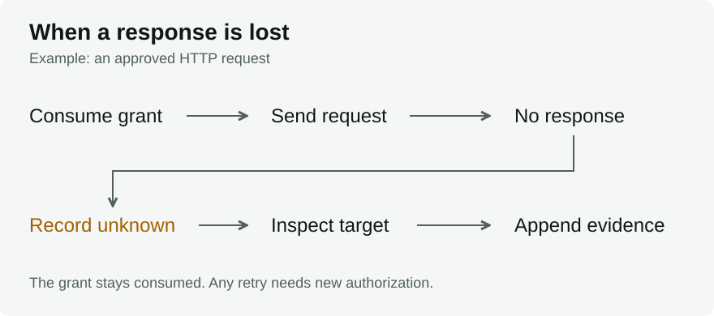

#  Effect Transaction Protocol

[](https://github.com/billmedj/etp/actions/workflows/ci.yml)
[](./LICENSE)

**Protocol:** Core 0.1 implementer draft; **Reference software:** 0.1.0-alpha.1

Effect Transaction Protocol (ETP) defines how an executor checks permission for
an external action proposed by an untrusted agent, then records what happened.
For example, an HTTP request needs authorization for its specific target and
arguments. Permission to use an HTTP tool alone is not enough.

This repository provides Rust and TypeScript verifiers, a Rust executor with a
SQLite lifecycle store, and test cases. Start by checking an example record chain.

## Try the verifier

Requires Node.js 22.6 or later. The TypeScript package has no runtime dependencies.
From a repository checkout:

```console
cd typescript
npm test
npm run verify -- ../vectors/positive-chain.json
```

The verifier checks record structure and bindings. It does not authorize or
execute the proposed action.

## How an action proceeds

A task authority commits the task independently of model output. The agent's
effect proposal binds the target, arguments, expected effect, pre-state, and
resource claim. An evaluator returns `allow`, `deny`, or `review`.

Only `allow` can produce an execution grant. Each proposal and decision can
produce at most one grant, bound to one executor audience. Before dispatch,
the executor validates the complete chain, checks current state, and atomically
consumes the short-lived grant to create one attempt.

The effect receipt records `not_dispatched`, `succeeded`, `failed`, or `unknown`
from observed evidence. An `unknown` outcome prevents blind retry. Reconciliation
appends evidence; it never restores the consumed grant or rewrites history.
Single-use claim does not prove that an external target applies an effect exactly once.



<details>
<summary>Record types</summary>

```text
TaskCommitment
      -> EffectProposal
      -> AuthorizationDecision
      -> ExecutionGrant
      -> EffectReceipt
      -> ReconciliationRecord?
```

See the [protocol specification](./SPEC.md) for fields and required checks.

</details>

## Run the other checks

Run each section from the repository root. Use the Rust toolchain pinned by
`rust-toolchain.toml`:

```console
cargo test --workspace --locked
cargo run --locked -p effect-transaction-cli -- verify vectors/positive-chain.json
```

The Core conformance suite contains 77 deterministic lifecycle cases:

```console
node --experimental-strip-types conformance/runner.ts
```

Write a machine-readable report with:

```console
node --experimental-strip-types conformance/runner.ts --report effect-transaction-conformance-report.json
```

The reference-profile suite checks document schemas and 50 profile vectors:

```console
cd profiles
npm ci --ignore-scripts
npm test
```

### Evidence checks

The repository pins Lean, TLA+ tools, Rust, and dependency lockfiles. CI uses
Node.js 24.10.0, Python 3.13, and Java 21. From the repository root:

```console
python tools/check-language.py
python tools/check-site.py
python -m unittest discover -s tests -v
cd formal/lean
lake build
cd ../..
python tools/check-lean.py
python tools/fetch-tla2tools.py
python tools/run-tla.py
python tools/check-evidence.py
python tools/source-manifest.py --git git
```

`tools/run-tla.py` performs the declared finite search and rewrites its result
record. Checked-in counters do not replace that run.

## Integrate ETP

An [effect profile](./profiles/) defines target identity, arguments, pre-state
checks, dispatch, observation, and reconciliation. Profiles can restrict actions;
they cannot expand task authority or weaken single-use and unknown-outcome rules.
Agent frameworks, policy languages, credentials, transports, and rollback engines
remain deployment choices.

A deployment needs complete mediation, durable atomic storage, protected keys,
trusted configuration and time, validated profiles, target-specific tests, and
external review. Core 0.1 is not an adopted standard or a production certification.
State checks before claim still leave a race before dispatch; mutating targets
need their own conditions or fencing.
Repository evidence does not establish prompt-injection immunity, external truth,
ecosystem interoperability, or a model-to-code refinement proof.

- [Implementation status](./IMPLEMENTATION_STATUS.md): components, evidence, and limits.
- [Threat model](./THREAT_MODEL.md): trust assumptions and residual risks.
- [Schemas](./schemas/), [vectors](./vectors/), and [conformance cases](./conformance/): record formats and executable checks.
- [Rust](./crates/) and [TypeScript](./typescript/): reference code.
- [Lean](./formal/lean/), [TLA+](./formal/tla/), and [evidence summary](./evidence-summary.json): formal artifacts, bounds, counts, and source hashes.
- [Related work](./RELATED_WORK.md) and [benchmarks](./BENCHMARKS.md): comparisons and measurement limits.

## Project policy

[Apache-2.0 license](./LICENSE) | [Contributing](./CONTRIBUTING.md) |
[Security reports](./SECURITY.md) | [Governance](./GOVERNANCE.md) |
[Versioning](./VERSIONING.md) | [Support](./SUPPORT.md) |
[Identity](./BRAND.md) | [Terminology](./LANGUAGE.md)
